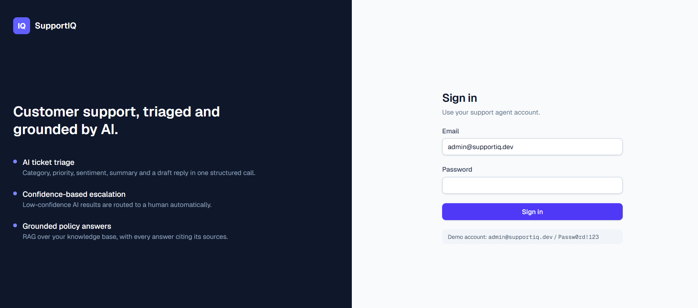
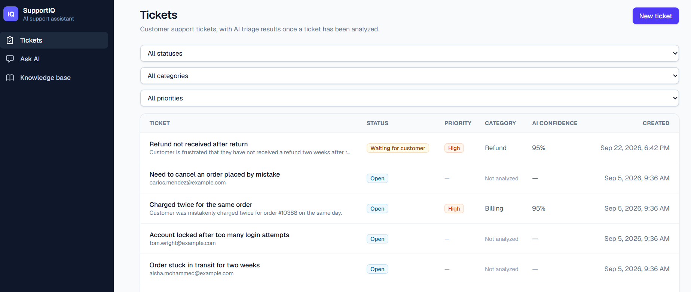
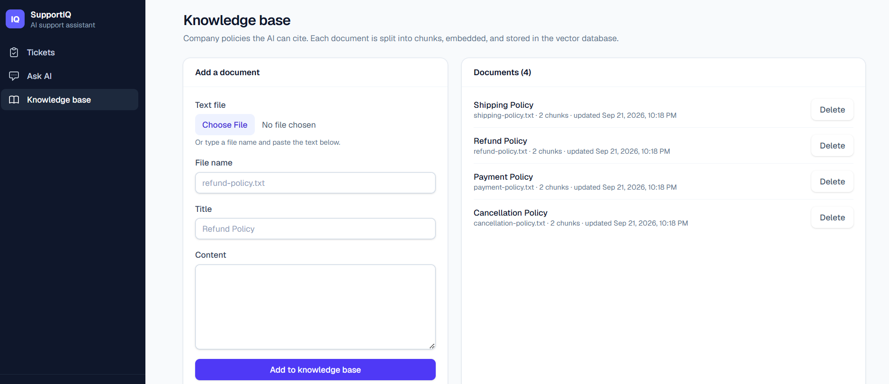
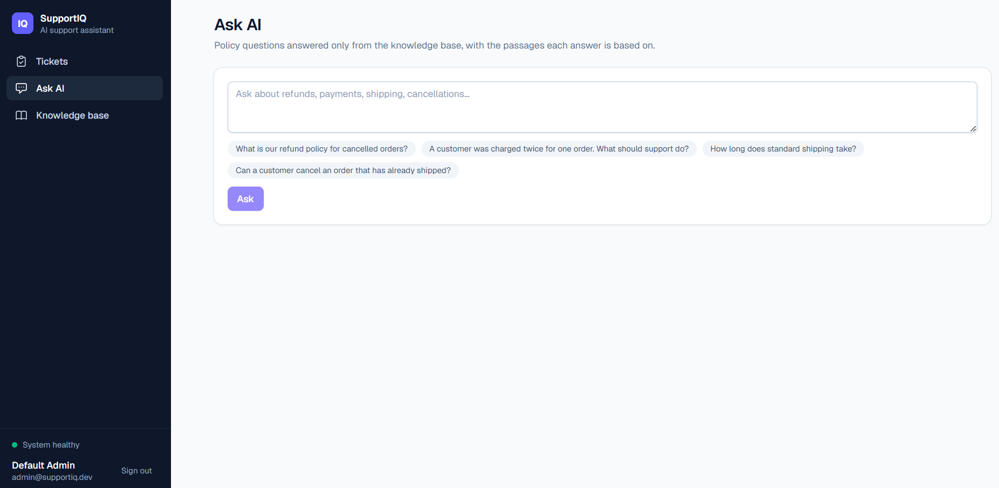
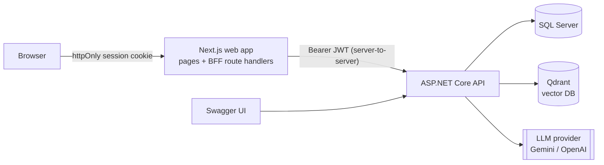
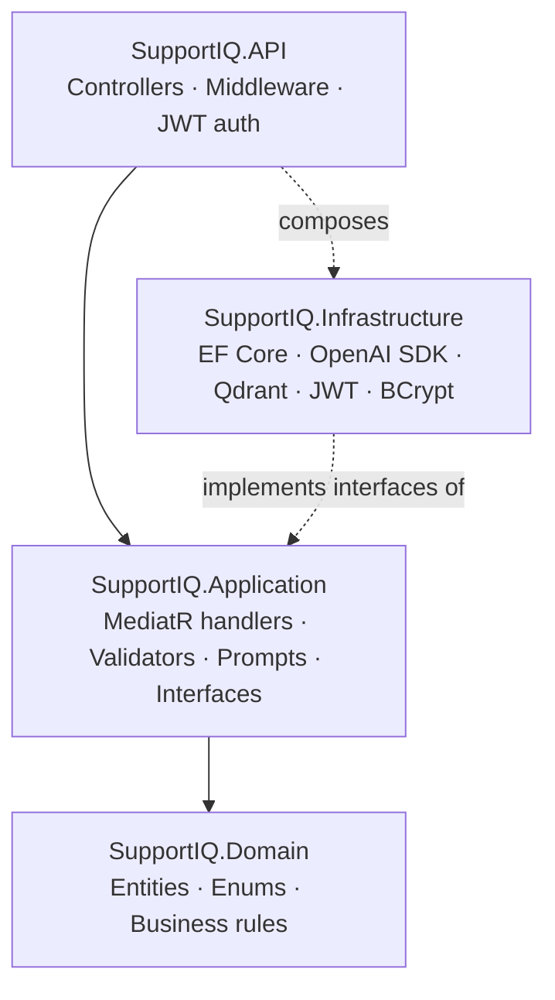
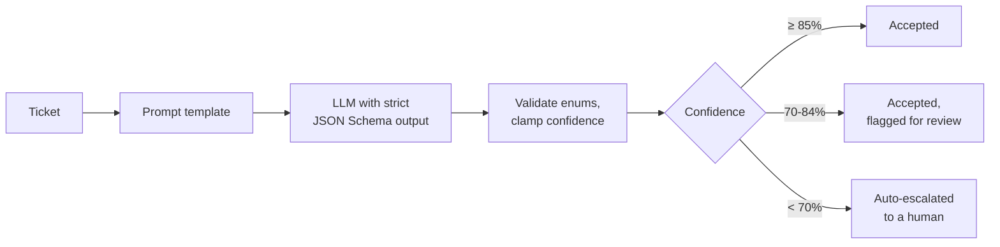
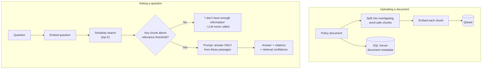

# SupportIQ

**AI-powered customer support: tickets triaged by AI, uncertain cases escalated to humans, and policy questions answered from your own documents - with sources.**

## Screenshots

| Sign in | Tickets |
|---|---|
|  |  |
| **Knowledge base** | **Ask AI** |
|  |  |

---

     

SupportIQ is a full-stack help-desk application for a customer support team. Agents manage tickets in a Next.js web app backed by an ASP.NET Core API, and the AI layer:

- **Triages tickets** - category, priority, sentiment, a one-line summary, tags, and a draft reply, returned as validated structured JSON in a single call.
- **Escalates to a human** automatically when the AI isn't confident in its own analysis.
- **Answers policy questions with RAG** - grounded only in the company knowledge base, citing the exact document passages used, and saying *"I don't know"* instead of guessing when nothing relevant exists.

It's built as a portfolio project to show how AI fits into a conventional, production-oriented application: clean architecture, provider-agnostic AI, security, resilience, testing, and one-command Docker deployment.

---

## Contents

- [Tech stack](#tech-stack)
- [Features](#features)
- [Screenshots](#screenshots)
- [Architecture](#architecture)
- [Folder structure](#folder-structure)
- [Running locally](#running-locally)
- [API reference](#api-reference)
- [Testing](#testing)
- [Design decisions](#design-decisions)
- [Future improvements](#future-improvements)

---

## Tech stack

| Layer | Technologies |
|---|---|
| **Frontend** | Next.js 16 (App Router), React 19, TypeScript, Tailwind CSS 4 |
| **Backend API** | .NET 8, ASP.NET Core Web API, MediatR 12 (CQRS), FluentValidation 11 |
| **AI** | Any OpenAI-compatible provider via the official OpenAI .NET SDK - **Google Gemini** (free tier, default) or OpenAI. Structured outputs (strict JSON Schema) and embeddings |
| **Vector search** | Qdrant (`Qdrant.Client`, cosine similarity) |
| **Database** | SQL Server 2022, Entity Framework Core 8 (code-first migrations) |
| **Auth & security** | JWT bearer tokens, BCrypt password hashing, httpOnly session cookies (backend-for-frontend pattern) |
| **Resilience** | Polly 8 - retry with exponential backoff, circuit breaker, per-attempt timeout |
| **Observability** | Serilog structured logging, health checks for SQL Server and Qdrant |
| **API docs** | Swagger / OpenAPI (Swashbuckle) with JWT support |
| **Testing** | xUnit, Moq, FluentAssertions, EF Core InMemory, Testcontainers (real SQL Server), ASP.NET Core `WebApplicationFactory` |
| **DevOps** | Docker, Docker Compose (4 services), multi-stage images |

---

## Features

### For support agents (web app)

- **Ticket management** - create, search, filter (status / category / priority), paginate, assign to an agent, change status, escalate, delete.
- **One-click AI analysis** - classifies the ticket, writes a summary and tags, drafts a reply, and shows a confidence meter.
- **Draft replies** - regenerate a customer reply without re-running the full analysis; copy to clipboard.
- **Automatic escalation** - when AI confidence is below 70%, the ticket is escalated for human review with the reason shown.
- **Knowledge base** - upload policy documents (`.txt` / `.md`); each is chunked, embedded, and made searchable.
- **Ask AI** - ask policy questions and get answers grounded in the knowledge base, with numbered citations and relevance scores for every source.
- **Live system status** - the sidebar shows whether the database and vector store are healthy.

### Under the hood

- **Structured AI output** - the model must return JSON matching a strict schema generated from the domain enums; every value is validated before it's saved.
- **Provider-agnostic AI** - business logic depends only on interfaces (`ITicketAiService`, `IEmbeddingService`, `IRagService`); switching OpenAI ↔ Gemini is configuration, not code.
- **Hallucination guard** - RAG discards passages below a relevance threshold and skips the LLM entirely when nothing relevant is found.
- **Cost control** - AI runs only on demand; re-uploading an unchanged document isn't re-embedded.
- **Secure by default** - the JWT never reaches browser JavaScript; no secrets in source control; the app fails fast if required secrets are missing.
- **Consistent errors** - every failure becomes an RFC 7807 `ProblemDetails` response with the right status code.
- **Privacy-aware logging** - logs record IDs, timings, and scores, never customer emails or message contents.
- **Seeded demo data** - two agents and seven realistic tickets are created on first run.

---


## Architecture

### System overview



The browser only ever talks to the Next.js server. The Next.js server holds the user's JWT in an httpOnly cookie and forwards requests to the API with the token attached (the **backend-for-frontend** pattern). The API owns all business logic and is the only component that talks to the database, the vector store, and the AI provider.

### Backend: Clean Architecture



| Project | Responsibility | Depends on |
|---|---|---|
| `SupportIQ.Domain` | `SupportTicket` aggregate, enums, business rules (e.g. closed tickets can't change) | nothing |
| `SupportIQ.Application` | Use cases as MediatR commands/queries, validation, DTOs, AI interfaces, prompt templates | Domain |
| `SupportIQ.Infrastructure` | EF Core persistence, OpenAI-compatible AI client, Qdrant, JWT, password hashing | Application, Domain |
| `SupportIQ.API` | HTTP endpoints, exception → `ProblemDetails` middleware, auth, Swagger, composition root | Application, Infrastructure |

This is a **modular monolith** on purpose: one deployable with clear internal boundaries, without the operational overhead of microservices.

### AI ticket analysis flow



1. The ticket is sent to the LLM with a centralized prompt (`Application/AI/Prompts`) and a **strict JSON Schema** built from the actual C# enums, so the schema can never drift from the domain model.
2. The response is parsed and **validated** - unknown categories, empty summaries, or out-of-range confidence are rejected as an `AIServiceException` (HTTP 502) instead of being saved.
3. The confidence policy decides whether the result is accepted, flagged, or the ticket is escalated. The thresholds are configuration (`AiConfidence` section), because they're a business judgment - an LLM's self-reported confidence isn't a calibrated probability.
4. The ticket is updated, an immutable `TicketAnalysis` history row and an `AuditLog` entry are written, and the result is returned.

### RAG pipeline (Ask AI)



- **Grounded answers only** - the LLM sees just the retrieved passages and is instructed to answer only from them and cite them (`[1]`, `[2]`, …).
- **Relevance gate** - passages below `Rag:MinRelevanceScore` are dropped before the LLM sees them. The threshold is per embedding model: measured on the sample knowledge base with Gemini embeddings, relevant questions scored 0.65-0.75 and off-topic ones ≤ 0.55, so Gemini uses **0.60** (OpenAI default: 0.70).
- **Honest confidence** - the reported confidence is the best vector-similarity score of the passages used, not a number the model makes up about itself.

### Web app authentication (BFF pattern)

- `POST /api/auth/login` (Next.js route) calls the API's login endpoint and stores the returned JWT in an **httpOnly, SameSite=Lax cookie** whose expiry matches the token's.
- `/api/backend/[...path]` forwards every browser request to the API with `Authorization: Bearer <token>` added server-side. The token is never readable by JavaScript (an XSS bug can't steal it), and the API needs no CORS configuration.
- `src/proxy.ts` redirects signed-out users to `/login`. That's a convenience check only; the API validates the JWT on every request, and an expired session sends the user back to sign in.

---

## Folder structure

```
SupportIQ/
├── src/                                   Backend (.NET 8)
│   ├── SupportIQ.API/
│   │   ├── Controllers/                   Tickets, Ai, Knowledge, Agents, Auth
│   │   ├── Middleware/                    ExceptionHandlingMiddleware (exceptions → ProblemDetails)
│   │   ├── Services/                      CurrentUserService (reads the agent from JWT claims)
│   │   ├── Extensions/                    JSON health-check response writer
│   │   └── Program.cs                     Composition root: DI, auth, Swagger, Serilog, health checks
│   │
│   ├── SupportIQ.Application/
│   │   ├── Abstractions/                  ITicketAiService, IEmbeddingService, IRagService, IVectorStore, ...
│   │   ├── AI/Prompts/                    TicketAnalysisPrompt, SuggestedResponsePrompt, GroundedAnswerPrompt
│   │   ├── Features/                      Tickets/, Knowledge/, Ai/, Agents/, Auth/ - commands, queries, handlers, validators
│   │   ├── DTOs/                          API response shapes
│   │   └── Common/                        Validation pipeline, exceptions, options, text chunker
│   │
│   ├── SupportIQ.Domain/
│   │   ├── Entities/                      SupportTicket, TicketTag, TicketAnalysis, SupportAgent, KnowledgeDocument, AuditLog
│   │   ├── Enums/                         TicketCategory, TicketPriority, TicketSentiment, TicketStatus, AgentRole
│   │   └── Exceptions/                    Domain rule violations
│   │
│   └── SupportIQ.Infrastructure/
│       ├── AI/                            OpenAI-compatible ticket AI, embeddings, RAG service, Polly resilience pipeline
│       ├── VectorStore/                   QdrantVectorStore
│       ├── Persistence/                   DbContext, entity configurations, migrations, repository, seed data
│       ├── Identity/                      JWT token service, BCrypt password hasher
│       └── DependencyInjection.cs
│
├── frontend/                              Web app (Next.js 16)
│   ├── public/screenshots/                README screenshots
│   └── src/
│       ├── app/(app)/                     Signed-in pages: tickets, ticket detail, new ticket, knowledge, ask
│       ├── app/login/                     Sign-in page
│       ├── app/api/                       BFF routes: auth/login, auth/logout, health, backend/[...path]
│       ├── components/                    UI primitives, badges, sidebar, safe markdown renderer
│       ├── lib/                           Typed API client, DTO types, server-only session helpers
│       └── proxy.ts                       Route guard
│
├── tests/
│   ├── SupportIQ.UnitTests/               41 tests: domain rules, handlers (mocked AI), validators, chunker
│   └── SupportIQ.IntegrationTests/        14 tests: full HTTP pipeline against real SQL Server (Testcontainers)
│
├── knowledge/                             Sample policy documents: refund, payment, shipping, cancellation
├── Dockerfile                             API image
├── docker-compose.yml                     Web app + API + SQL Server + Qdrant
└── .env.example                           Configuration template (no real secrets)
```

---

## Running locally

### Prerequisites

- [Docker Desktop](https://www.docker.com/products/docker-desktop/) - required
- An AI API key - the app starts without one, but AI features need it:
  - **Google Gemini (free, no credit card):** create a key at [aistudio.google.com/apikey](https://aistudio.google.com/apikey)
  - or **OpenAI (paid):** [platform.openai.com/api-keys](https://platform.openai.com/api-keys)
- For running outside Docker (optional): [.NET 8 SDK](https://dotnet.microsoft.com/download) and [Node.js 22](https://nodejs.org/)

### Option A - Docker Compose (recommended)

**1. Clone and configure**

```bash
git clone <your-repo-url> SupportIQ
cd SupportIQ
cp .env.example .env
```

Open `.env` and set:

| Setting | Value |
|---|---|
| `SQL_SA_PASSWORD` | Any strong password (upper + lower case, digit, symbol, 8+ chars) |
| `JWT_SECRET` | A random string of at least 32 characters (e.g. `openssl rand -base64 32`) |
| `AI_API_KEY` | Your Gemini (or OpenAI) key |

The Gemini settings (`AI_BASE_URL`, `AI_MODEL`, `AI_EMBEDDING_MODEL`, `EMBEDDING_DIMENSIONS`, `RAG_MIN_RELEVANCE_SCORE`) are pre-filled in `.env.example`. To use OpenAI instead, use the commented OpenAI block in that file.

**2. Start everything**

```bash
docker compose up --build
```

The first build takes several minutes (it downloads .NET, Node, SQL Server, and Qdrant images). The API applies database migrations and seeds demo data automatically.

| Service | URL |
|---|---|
| **Web app** | **http://localhost:3200** |
| API (Swagger) | http://localhost:5080/swagger |
| Health check | http://localhost:5080/health |

**3. Sign in**

- Email: `admin@supportiq.dev`
- Password: `Passw0rd!123`

(A second demo agent, `agent@supportiq.dev`, uses the same password.)

**4. Try it out**

1. **Tickets** → open a seeded ticket → **Analyze with AI**.
2. **Knowledge base** → upload the four files from the `knowledge/` folder (choose the file; the title fills in automatically).
3. **Ask AI** → click an example question and check the cited sources.

**Stopping**

```bash
docker compose down        # stop (data is kept)
docker compose down -v     # stop and delete all data (database + vectors)
```

### Option B - Run the API and web app without Docker (for development)

Keep SQL Server and Qdrant in Docker, and run the API and web app directly:

```bash
# 1. Databases only
docker compose up -d sqlserver qdrant

# 2. API (new terminal)
export ConnectionStrings__DefaultConnection="Server=localhost,14333;Database=SupportIQ;User Id=sa;Password=<SQL_SA_PASSWORD>;TrustServerCertificate=True;"
export Jwt__Secret="<a random secret of at least 32 characters>"
export Ai__ApiKey="<your key>"
export Ai__BaseUrl="https://generativelanguage.googleapis.com/v1beta/openai/"   # omit for OpenAI
export Ai__Model="gemini-3.5-flash-lite"
export Ai__EmbeddingModel="gemini-embedding-001"
export Qdrant__Port="16334"
export Qdrant__VectorSize="3072"
export Rag__MinRelevanceScore="0.60"
export ASPNETCORE_ENVIRONMENT="Development"
dotnet run --project src/SupportIQ.API          # note the port it prints, e.g. 5xxx

# 3. Web app (new terminal)
cd frontend
npm install
API_BASE_URL=http://localhost:5xxx npm run dev -- -p 3200
```

On Windows PowerShell, set variables with `$env:NAME = "value"` instead of `export`.

### Configuration reference

With Docker Compose, set these short names in `.env` (`docker-compose.yml` maps them onto the app settings):

| `.env` variable | Default | Purpose |
|---|---|---|
| `SQL_SA_PASSWORD` | - (required) | SQL Server `sa` password |
| `JWT_SECRET` | - (required) | JWT signing key, ≥ 32 characters |
| `AI_API_KEY` | empty | AI provider key; AI endpoints return 502 without it |
| `AI_BASE_URL` | empty (OpenAI) | OpenAI-compatible endpoint, e.g. Gemini's |
| `AI_MODEL` | `gpt-4o-mini` | Chat model |
| `AI_EMBEDDING_MODEL` | `text-embedding-3-small` | Embedding model |
| `EMBEDDING_DIMENSIONS` | `1536` | Must match the embedding model (Gemini `gemini-embedding-001`: 3072) |
| `RAG_MIN_RELEVANCE_SCORE` | `0.70` | RAG relevance gate (Gemini: 0.60) |
| `FRONTEND_PORT` / `API_PORT` | `3200` / `5080` | Host ports |
| `SQL_PORT` / `QDRANT_HTTP_PORT` / `QDRANT_GRPC_PORT` | `14333` / `16333` / `16334` | Host ports |

When running the API directly, use ASP.NET Core's `Section__Key` names instead (e.g. `Ai__Model`, `Qdrant__VectorSize`, `Rag__MinRelevanceScore`, `AiConfidence__AcceptThreshold`). The committed `appsettings.json` contains no secrets, and the API refuses to start if the connection string or JWT secret is missing.

### Troubleshooting

| Symptom | Cause | Fix |
|---|---|---|
| AI features show *"The AI provider failed…"* and the API logs show `429 Too Many Requests` | Free-tier quota for that model is used up | Change `AI_MODEL` in `.env` (e.g. between `gemini-3.5-flash` and `gemini-3.5-flash-lite`), then `docker compose up -d api` |
| Same error with `503 Service Unavailable` in the logs | The provider's model is temporarily overloaded | Wait a few minutes or switch `AI_MODEL` as above |
| `ports are not available` / `port is already allocated` on startup | Another app, or Windows Hyper-V/WSL, holds the port (check with `netsh interface ipv4 show excludedportrange protocol=tcp`) | Set a different `FRONTEND_PORT`, `API_PORT`, `SQL_PORT`, or `QDRANT_*_PORT` in `.env` |
| Ask AI always says it doesn't have enough information | Knowledge base is empty, or the relevance threshold is too strict for your embedding model | Upload documents; check the `top score` in `docker compose logs api` and tune `RAG_MIN_RELEVANCE_SCORE` |
| Errors about vector size after switching AI provider | Existing vectors were created with a different embedding size | `docker compose down -v`, then start again and re-upload documents |

View API logs with `docker compose logs -f api`.

---

## API reference

Full interactive docs are at `/swagger`. Every endpoint except login and health requires `Authorization: Bearer <token>`.

| Method | Endpoint | Description |
|---|---|---|
| `POST` | `/api/auth/login` | Sign in; returns a JWT |
| `GET` | `/api/tickets` | Search tickets (`status`, `category`, `priority`, `assignedAgentId`, `page`, `pageSize`) |
| `POST` | `/api/tickets` | Create a ticket |
| `GET` / `PUT` / `DELETE` | `/api/tickets/{id}` | Get / update / delete a ticket |
| `POST` | `/api/tickets/{id}/analyze` | Run AI analysis (auto-escalates on low confidence) |
| `POST` | `/api/tickets/{id}/generate-response` | Draft a new customer reply |
| `POST` | `/api/tickets/{id}/assign` | Assign to an agent |
| `PUT` | `/api/tickets/{id}/status` | Change status |
| `POST` | `/api/tickets/{id}/escalate` | Escalate manually with a reason |
| `GET` | `/api/agents` | List support agents |
| `GET` / `POST` | `/api/knowledge/documents` | List / ingest knowledge documents |
| `DELETE` | `/api/knowledge/documents/{id}` | Delete a document and its vectors |
| `POST` | `/api/ai/ask` | Ask a question answered by RAG with sources |
| `POST` | `/api/ai/analyze-ticket` | Same as `/tickets/{id}/analyze`, with the id in the body |
| `GET` | `/health` | SQL Server and Qdrant health |

**Example - AI analysis** (`POST /api/tickets/{id}/analyze`):

```json
{
  "category": "Refund",
  "priority": "High",
  "sentiment": "Frustrated",
  "summary": "Customer has not received a refund two weeks after returning their headphones.",
  "tags": ["refund", "return", "tracking"],
  "suggestedResponse": "I'm very sorry your refund hasn't arrived yet...",
  "confidence": 0.95,
  "escalated": false
}
```

**Example - Ask AI** (`POST /api/ai/ask`):

```json
{
  "answer": "According to [1], refunds are issued to the original payment method within 5 to 7 business days after the returned item is received and inspected.",
  "confidence": 0.65,
  "sources": [{ "document": "Refund Policy", "chunk": 0, "relevance": 0.65 }]
}
```

Errors use RFC 7807 `ProblemDetails`: validation `422`, not found `404`, bad login `401`, invalid ticket state `409`, AI provider failure `502`, vector store unavailable `503`. Stack traces are never returned.

---

## Testing

```bash
dotnet test                                    # all 55 tests
dotnet test tests/SupportIQ.UnitTests          # 41 unit tests - fast, no Docker needed
dotnet test tests/SupportIQ.IntegrationTests   # 14 integration tests - needs Docker
```

- **Unit tests** cover domain rules, the confidence/escalation policy (including exact threshold boundaries), the text chunker, the validation pipeline, and knowledge-ingestion cost control, with the AI mocked. **No test ever calls a real AI provider.**
- **Integration tests** boot the real API against a disposable SQL Server container (Testcontainers), so migrations, JWT auth, validation, and persistence all run for real. The AI and vector store are replaced by deterministic fakes; the fake vector store does real cosine-similarity math, so the RAG relevance gate is genuinely exercised.

Frontend checks:

```bash
cd frontend
npm run lint
npm run build      # includes TypeScript type checking
```

---

## Design decisions

- **Interfaces around the AI provider.** Handlers depend on `ITicketAiService` / `IEmbeddingService` / `IRagService`; only `Infrastructure/AI` knows about the OpenAI SDK. That's why moving from OpenAI to Gemini's free tier required configuration only.
- **Validate AI output like user input.** Structured output reduces malformed responses but doesn't eliminate them, so every field is checked before anything is saved.
- **Escalation policy in the application layer.** The domain entity only *applies* an analysis; the handler decides escalation from configurable thresholds, so the business can tune them without a code change.
- **`IApplicationDbContext` instead of a repository per table.** EF Core's `DbSet` already is a repository; only `SupportTicket`, which has real query logic (filters, paging, includes), gets a dedicated `ITicketRepository`.
- **Resilience order matters.** Retry (outer) → circuit breaker → per-attempt timeout (inner), so each retry gets a fresh timeout and a failing provider stops being hammered.
- **Migrations on startup (Development only).** Keeps `docker compose up` one-step for a demo; a production pipeline would run migrations as a separate deployment step.

---

## Future improvements

- Automatic fallback to a second AI model when the primary returns 429/503.
- PDF/DOCX text extraction for knowledge uploads.
- Streaming AI responses in the UI.
- Showing the ticket's AI analysis history (already stored in `TicketAnalyses`) in the web app.
- Role-based UI (admin-only actions) and agent self-service registration.
