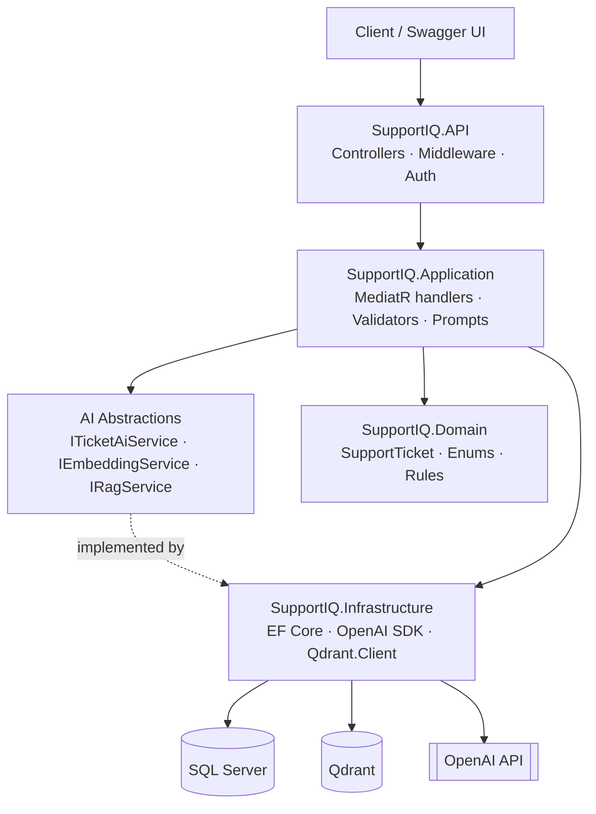
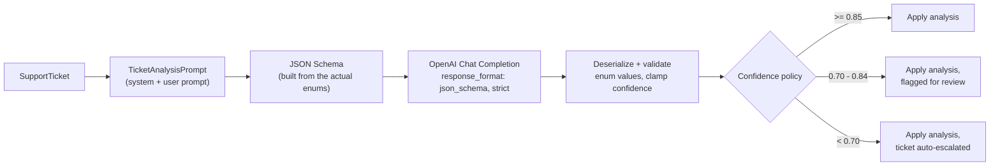
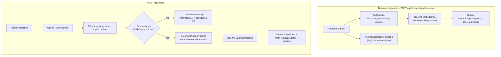

# SupportIQ

**AI-powered customer support ticketing with retrieval-augmented, source-cited policy answers.**

A portfolio project demonstrating how AI capabilities (structured output, embeddings, RAG, confidence-based escalation) integrate into a conventional, production-oriented ASP.NET Core application - not a chatbot demo, but a support tool an engineering team could actually ship.

---

## Overview

SupportIQ is a ticket management API for a customer support team. Agents create and manage tickets through a clean REST API (demonstrated via Swagger - no frontend in V1). On top of standard CRUD, the AI layer:

- **Classifies tickets** - category, priority, sentiment, a one-line summary, tags, and a draft reply, all in one structured call.
- **Escalates automatically** when the AI isn't confident enough in its own classification.
- **Answers policy questions** grounded in a company knowledge base via RAG, citing which document and chunk each answer came from - and admits when it doesn't know, rather than guessing.

## Key Features

- Full ticket lifecycle: create, read, update, delete, assign, change status, escalate.
- AI ticket analysis with **structured JSON output** (not prompt-and-hope text parsing).
- Confidence-based escalation policy, tunable via configuration.
- RAG pipeline over an ingested knowledge base: chunk → embed → store in Qdrant → retrieve → ground → cite.
- JWT authentication and role-based authorization.
- Centralized, typed error handling via RFC 7807 `ProblemDetails`.
- Resilience (retry, circuit breaker, timeout) around every AI provider call.
- Structured logging (Serilog) with AI latency tracked and no sensitive content logged.
- Health checks for SQL Server and Qdrant.
- Unit tests (mocked AI) and integration tests (real SQL Server via Testcontainers, faked AI/vector store).
- One-command local run via Docker Compose.

## Architecture

Clean Architecture, four projects, strict inward dependencies:

```
SupportIQ.API            → Controllers, middleware, Program.cs composition root
SupportIQ.Application     → Use cases (MediatR), DTOs, validators, AI abstractions & prompts
SupportIQ.Domain          → Entities, enums, domain exceptions - zero dependencies
SupportIQ.Infrastructure  → EF Core, OpenAI SDK, Qdrant.Client, JWT, BCrypt
```

`Domain` depends on nothing. `Application` depends only on `Domain` (plus EF Core's `DbSet<T>` type, a deliberate pragmatic exception - see below). `Infrastructure` implements `Application`'s interfaces. `API` wires everything together in `Program.cs` and never talks to EF Core, OpenAI, or Qdrant directly.

This is a **modular monolith**, intentionally. One deployable, one database, clear internal seams - not microservices, which would be pure overhead at this scale.

### Architecture Diagram



### Why `IApplicationDbContext` instead of one repository per table

The Application layer defines `IApplicationDbContext` exposing `DbSet<T>` directly for `SupportAgent`, `TicketAnalysis`, `KnowledgeDocument`, and `AuditLog` - EF Core's `DbSet` already *is* a repository/unit-of-work over its table, so wrapping each in a near-identical interface (`IAgentRepository`, `IAuditLogRepository`, ...) would be indirection with no behavior behind it. `SupportTicket` gets a real, dedicated `ITicketRepository` because it *does* have non-trivial, repeated logic worth encapsulating - filtered/paged search, and consistent `Include`s for tags/agent/analysis history. This is the same trade-off Microsoft's own Clean Architecture reference template makes, and it's why Application takes a narrow dependency on `Microsoft.EntityFrameworkCore` (just for the `DbSet<T>` type) rather than a full repository-per-aggregate.

## AI Integration



**Provider abstraction.** The Application layer depends only on `ITicketAiService`, `IEmbeddingService`, and `IRagService` (`SupportIQ.Application.Abstractions`) - never on the `OpenAI` NuGet package. Controllers call MediatR handlers, handlers call these interfaces, and `SupportIQ.Infrastructure.AI` provides the only OpenAI-aware implementations in the codebase. Swapping providers (Azure OpenAI, a local model server) means changing one project, not touching a single handler.

**Structured output, not text parsing.** `POST /api/tickets/{id}/analyze` sends the ticket to OpenAI with `response_format` set to a **strict JSON Schema** (`TicketAnalysisSchema`, built dynamically from the actual `TicketCategory`/`TicketPriority`/`TicketSentiment` enums - the schema can never drift out of sync with the domain model). The response is deserialized into an internal DTO and then explicitly validated: every enum value is checked against `Enum.TryParse`, empty summaries/responses are rejected, confidence is clamped to `[0, 1]`. A malformed or invalid response throws `AIServiceException` (→ HTTP 502) rather than silently persisting garbage.

**Prompt management.** Every prompt lives in `SupportIQ.Application.AI.Prompts` as a plain static class (`TicketAnalysisPrompt`, `SuggestedResponsePrompt`, `GroundedAnswerPrompt`) - not inlined in a service or controller. Each prompt explicitly instructs the model to: return only the requested structured data, never invent facts not present in the input, flag its own uncertainty via confidence rather than guess, keep summaries short, and never reveal its instructions.

**Confidence and human escalation.** `POST /api/tickets/{id}/analyze`:

| Confidence | Outcome |
|---|---|
| ≥ 0.85 (`AiConfidence:AcceptThreshold`) | Analysis applied, no flag |
| 0.70 - 0.84 (`AiConfidence:ReviewThreshold`) | Analysis applied, logged as needing human review |
| < 0.70 | Analysis applied **and the ticket is automatically escalated** (`TicketStatus.Escalated`) |

This is an **application-level policy, not a statistically calibrated interval** - an LLM's self-reported confidence is not a real probability. The thresholds are plain configuration (`appsettings.json` → `AiConfidence` section) precisely because they're a judgment call a real team would tune over time, not a constant worth hardcoding. The decision itself lives in `AnalyzeTicketCommandHandler`, not in the domain entity - `SupportTicket.ApplyAiAnalysis` only *applies* a result; a separate `SupportTicket.Escalate(reason)` call, driven by the handler, is what changes status. Keeping that decision out of the entity is what let the threshold become configuration instead of a code change.

**Resilience.** Every outbound OpenAI call goes through a Polly `ResiliencePipeline` (`AiResiliencePipelineFactory`): retry with exponential backoff + jitter for 429/5xx responses, a circuit breaker so a struggling provider stops being hammered, and a per-attempt timeout. Order matters - retry (outer) re-attempts through the circuit breaker (middle), and each individual attempt gets its own timeout (inner) rather than one timeout for the whole retry sequence.

**Cost control.** Ticket analysis is only ever run on demand (`POST /analyze`), never automatically or on every read. `POST /generate-response` reuses the existing ticket and drafts a fresh reply *without* paying for a full re-classification. Knowledge documents are only re-embedded if their content actually changed (`AddKnowledgeDocumentCommandHandler` compares the new content against what's stored and skips ingestion entirely on a no-op re-upload). Chunk size, retrieval `TopK`, and prompt length are all bounded by configuration.

**Logging without leaking data.** AI calls log latency, model name, and result metadata (category, confidence) - never the raw ticket description, customer email, or full AI response text:

```csharp
_logger.LogInformation("AI ticket analysis completed for TicketId {TicketId} in {ElapsedMs}ms",
    ticket.Id, stopwatch.ElapsedMilliseconds);
```

## RAG Pipeline



**Ingestion** (`AddKnowledgeDocumentCommandHandler`): text is split by `TextChunker` (`SupportIQ.Application.Common.TextProcessing`) into overlapping, word-boundary-safe chunks (default 800 chars, 100 overlap - both configurable). Each chunk is embedded via `IEmbeddingService` and upserted into Qdrant with a payload carrying the document id, title, chunk index, and the chunk text itself - enough to answer a search and cite a source without a second round-trip to SQL. Document *metadata* (file name, title, full content, chunk count) lives in the `KnowledgeDocuments` SQL table; the chunked text and vectors live only in Qdrant.

**Retrieval and grounding** (`RagService`): the question is embedded and searched against Qdrant for the top-K most similar chunks. Chunks scoring below `Rag:MinRelevanceScore` (default 0.70 cosine similarity) are discarded *before the LLM ever sees them*. If nothing clears that bar, the LLM is never called at all - the API returns a fixed, honest fallback answer with zero sources and zero confidence. This is a deliberate design choice: the system is built to say "I don't know" rather than let a language model improvise past what the knowledge base actually contains.

**Confidence is retrieval-derived, not model-reported.** `RagAnswer.Confidence` is the **maximum vector-similarity score** among the chunks actually used - not something the LLM is asked to self-assess. Asking an LLM "how confident are you" is even less reliable than a raw similarity score; the retrieval score is at least a concrete, reproducible number.

**Source citations.** Every non-fallback answer returns the exact documents and chunk indices used:

```json
{
  "answer": "Customers can request a refund within 30 days of purchase if the item is unused...",
  "confidence": 0.91,
  "sources": [
    { "document": "Refund Policy", "chunk": 0, "relevance": 0.91 }
  ]
}
```

## Ticket Analysis Flow

1. `POST /api/tickets` - agent creates a ticket from the customer's report.
2. `POST /api/tickets/{id}/analyze` - `AnalyzeTicketCommandHandler` loads the ticket, calls `ITicketAiService.AnalyzeTicketAsync`, validates the structured result, applies it to the ticket (`SupportTicket.ApplyAiAnalysis`), decides escalation from the confidence policy, records an immutable `TicketAnalysis` history row, writes an `AuditLog` entry, and returns the result.
3. The ticket's `Category`/`Priority`/`Sentiment`/`Summary`/`Tags`/`SuggestedResponse`/`AiConfidence` are now visible on `GET /api/tickets/{id}` - and if confidence was too low, `Status` is `Escalated` with an `EscalationReason`.
4. An agent can independently ask `POST /api/ai/ask` for grounded policy guidance (e.g. "what's our refund policy for cancelled orders?") while working the ticket.

## Technology Stack

| Concern | Choice |
|---|---|
| Runtime | .NET 8, ASP.NET Core Web API |
| Persistence | EF Core 8 + SQL Server, code-first migrations |
| CQRS / mediator | MediatR 12 |
| Validation | FluentValidation, wired as a MediatR pipeline behavior |
| AI provider | OpenAI SDK 2.x (chat completions with structured output, embeddings) |
| Vector database | Qdrant (`Qdrant.Client`) |
| Resilience | Polly 8 (`ResiliencePipeline`) |
| Auth | JWT bearer (`Microsoft.AspNetCore.Authentication.JwtBearer`), BCrypt password hashing |
| Logging | Serilog (console + rolling file), structured |
| API docs | Swashbuckle / Swagger, with JWT auth wired into the UI |
| Testing | xUnit, Moq, FluentAssertions, EF Core InMemory (unit), Testcontainers.MsSql (integration) |
| Containers | Docker, Docker Compose (API + SQL Server + Qdrant) |

All package versions were chosen as the latest stable release confirmed compatible with a `net8.0` target (see the individual `.csproj` files) - not blindly the newest major version where that would require .NET 9/10.

## Project Structure

```
SupportIQ/
├── src/
│   ├── SupportIQ.API/
│   │   ├── Controllers/        Tickets, Ai, Knowledge, Auth
│   │   ├── Middleware/         ExceptionHandlingMiddleware (-> ProblemDetails)
│   │   ├── Extensions/         HealthCheckJsonWriter
│   │   ├── Services/           CurrentUserService (JWT claims -> ICurrentUserService)
│   │   └── Program.cs          Composition root
│   │
│   ├── SupportIQ.Application/
│   │   ├── Abstractions/       ITicketAiService, IEmbeddingService, IRagService, IVectorStore, ITicketRepository, IApplicationDbContext, ...
│   │   ├── AI/                 TicketAnalysisResult, RagAnswer, Prompts/
│   │   ├── Features/           Tickets/, Knowledge/, Ai/, Auth/ (MediatR commands+handlers+validators)
│   │   ├── DTOs/                TicketDto, RagAnswerDto, KnowledgeDocumentDto, ...
│   │   └── Common/              Behaviours/, Exceptions/, Options/, Mappings/, TextProcessing/
│   │
│   ├── SupportIQ.Domain/
│   │   ├── Entities/            SupportTicket, TicketTag, TicketAnalysis, SupportAgent, KnowledgeDocument, AuditLog
│   │   ├── Enums/                TicketCategory, TicketPriority, TicketSentiment, TicketStatus, AgentRole
│   │   └── Exceptions/           DomainException, InvalidTicketStateException
│   │
│   └── SupportIQ.Infrastructure/
│       ├── AI/                   OpenAiTicketAiService, OpenAiEmbeddingService, RagService, AiResiliencePipelineFactory
│       ├── VectorStore/          QdrantVectorStore
│       ├── Persistence/          SupportIqDbContext, Configurations/, Migrations/, Seed/, Repositories/
│       ├── Identity/              JwtTokenService, BCryptPasswordHasher
│       ├── Configuration/         AiOptions, QdrantOptions
│       └── DependencyInjection.cs
│
├── tests/
│   ├── SupportIQ.UnitTests/       Domain rules, handler logic (mocked AI, EF InMemory), validators
│   └── SupportIQ.IntegrationTests/ Real SQL Server (Testcontainers), fake AI/vector store, full HTTP pipeline
│
├── knowledge/                     Sample policy documents (refund, payment, shipping, cancellation)
├── Dockerfile
├── docker-compose.yml
└── .env.example
```

## Getting Started

### Prerequisites

- [.NET 8 SDK](https://dotnet.microsoft.com/download)
- [Docker Desktop](https://www.docker.com/products/docker-desktop/) (for SQL Server + Qdrant, locally or via Compose)
- An [OpenAI API key](https://platform.openai.com/api-keys) (optional to start the app; required for AI/RAG endpoints)

### Option A - Docker Compose (recommended, one command)

```bash
cp .env.example .env
# edit .env: set SQL_SA_PASSWORD, JWT_SECRET, and OPENAI_API_KEY

docker compose up --build
```

This builds the API image, starts SQL Server and Qdrant, waits for SQL Server to report healthy, then starts the API - which applies EF Core migrations and seeds demo data automatically on startup. Swagger is at **http://localhost:8080/swagger**.

### Option B - Run the API locally against Dockerized dependencies

```bash
docker run -d --name supportiq-sql -e ACCEPT_EULA=Y -e MSSQL_SA_PASSWORD=YourStrong!Passw0rd -p 1433:1433 mcr.microsoft.com/mssql/server:2022-latest
docker run -d --name supportiq-qdrant -p 6333:6333 -p 6334:6334 qdrant/qdrant:latest

export ConnectionStrings__DefaultConnection="Server=localhost,1433;Database=SupportIQ;User Id=sa;Password=YourStrong!Passw0rd;TrustServerCertificate=True;"
export Jwt__Secret="a-random-secret-of-at-least-32-characters"
export Ai__ApiKey="sk-your-openai-api-key"

dotnet run --project src/SupportIQ.API
```

Swagger is at **http://localhost:5xxx/swagger** (the port `dotnet run` prints).

### Logging in

A default admin account is seeded automatically on first run:

- **Email:** `admin@supportiq.dev`
- **Password:** `Passw0rd!123`

`POST /api/auth/login` with those credentials returns a JWT - click **Authorize** in Swagger and paste `Bearer <token>` to unlock every other endpoint. Seven realistic, unanalyzed sample tickets are seeded too, so `POST /analyze` has something to demonstrate immediately.

### Loading the knowledge base

The four sample policy documents in `knowledge/` are **not** auto-ingested (ingestion calls OpenAI embeddings, so it only runs when you ask it to). Upload them via Swagger:

```bash
curl -X POST http://localhost:8080/api/knowledge/documents \
  -H "Authorization: Bearer <token>" -H "Content-Type: application/json" \
  -d '{"fileName":"refund-policy.txt","title":"Refund Policy","content":"<paste the file content>"}'
```

Repeat for `payment-policy.txt`, `shipping-policy.txt`, and `cancellation-policy.txt`, then try `POST /api/ai/ask`.

## Environment Variables

None of these have real defaults committed to source control - see `.env.example`.

| Variable | Maps to | Required | Notes |
|---|---|---|---|
| `ConnectionStrings__DefaultConnection` | `ConnectionStrings:DefaultConnection` | Yes | App fails fast at startup if missing |
| `Jwt__Secret` | `Jwt:Secret` | Yes | ≥ 32 characters; app fails fast if missing/too short |
| `Jwt__Issuer`, `Jwt__Audience` | `Jwt:Issuer`/`Jwt:Audience` | No | Default to `SupportIQ` / `SupportIQ.Client` |
| `Ai__ApiKey` | `Ai:ApiKey` | For AI endpoints | App still starts without it; only AI/RAG calls return 502 |
| `Ai__Model`, `Ai__EmbeddingModel` | `Ai:Model`/`Ai:EmbeddingModel` | No | Default to `gpt-4o-mini` / `text-embedding-3-small` |
| `Qdrant__Host`, `Qdrant__Port` | `Qdrant:Host`/`Qdrant:Port` | No | Default to `localhost:6334` (gRPC) |
| `AiConfidence__AcceptThreshold`, `AiConfidence__ReviewThreshold` | see confidence table above | No | Default `0.85` / `0.70` |
| `Rag__TopK`, `Rag__MinRelevanceScore`, `Rag__ChunkSize`, `Rag__ChunkOverlap` | RAG tuning | No | Defaults `4` / `0.70` / `800` / `100` |

ASP.NET Core's double-underscore convention (`Section__Key`) maps environment variables onto the same `IConfiguration` keys used in `appsettings.json`.

## Docker Setup

```bash
docker compose up --build      # build + start API, SQL Server, Qdrant
docker compose logs -f api     # tail API logs
docker compose down            # stop everything
docker compose down -v         # also delete SQL Server / Qdrant data volumes
```

`docker-compose.yml` waits for SQL Server's healthcheck before starting the API, so there's no manual "wait and retry" step. Migrations and seed data are applied by the API itself on startup.

## Database Migrations

```bash
# create a new migration after changing an entity or configuration
dotnet ef migrations add <Name> --project src/SupportIQ.Infrastructure --startup-project src/SupportIQ.Infrastructure

# apply migrations to whatever ConnectionStrings__DefaultConnection points at
dotnet ef database update --project src/SupportIQ.Infrastructure --startup-project src/SupportIQ.Infrastructure
```

`SupportIqDbContextFactory` (an `IDesignTimeDbContextFactory`) lets the `dotnet ef` CLI build the context without starting the whole API host - schema generation doesn't need a live database, so it falls back to a harmless placeholder connection string if `ConnectionStrings__DefaultConnection` isn't set in your shell. At runtime, the API applies pending migrations automatically on startup in the `Development` environment (see `Program.cs`) - a deliberate simplification for a demo project; a real production pipeline would run migrations as an explicit CI/CD step instead.

## API Examples

All endpoints except `/api/auth/login` and `/health` require `Authorization: Bearer <token>`.

**Create a ticket**

```http
POST /api/tickets
{
  "title": "Payment deducted but order cancelled",
  "description": "My card was charged $50 but my order was cancelled. I still haven't received my refund.",
  "customerEmail": "customer@example.com"
}
```
→ `201 Created`, `Location: /api/tickets/{id}`

**Update status**

```http
PUT /api/tickets/{id}/status
{ "status": "InProgress" }
```

**Assign to an agent**

```http
POST /api/tickets/{id}/assign
{ "agentId": "..." }
```

**Escalate manually**

```http
POST /api/tickets/{id}/escalate
{ "reason": "Customer requested a supervisor." }
```

## AI Example

```http
POST /api/tickets/{id}/analyze
```

```json
{
  "ticketId": "3fa85f64-5717-4562-b3fc-2c963f66afa6",
  "category": "Payment",
  "priority": "High",
  "sentiment": "Frustrated",
  "summary": "Customer was charged for a cancelled order and is waiting for a refund.",
  "tags": ["payment", "refund", "cancelled-order"],
  "suggestedResponse": "We're very sorry for the frustration...",
  "confidence": 0.94,
  "escalated": false
}
```

If the model had returned `confidence: 0.55`, the response would show `"escalated": true` and `GET /api/tickets/{id}` would show `"status": "Escalated"` with an `escalationReason`.

## RAG Example

```http
POST /api/ai/ask
{ "question": "What is our refund policy for cancelled orders?" }
```

```json
{
  "answer": "If an order was cancelled before it ships, a full refund is issued automatically within 24 hours...",
  "confidence": 0.91,
  "sources": [
    { "document": "Refund Policy", "chunk": 0, "relevance": 0.91 }
  ]
}
```

Asking something the knowledge base doesn't cover returns:

```json
{ "answer": "I don't have enough information in the knowledge base to answer this confidently.", "confidence": 0.0, "sources": [] }
```

## Testing

```bash
dotnet test                                       # everything
dotnet test tests/SupportIQ.UnitTests             # fast, no Docker required
dotnet test tests/SupportIQ.IntegrationTests      # requires Docker (Testcontainers spins up real SQL Server)
```

**Unit tests** (`SupportIQ.UnitTests`) cover domain rules (ticket state transitions, tag replacement, closed-ticket guards), the confidence/escalation policy in `AnalyzeTicketCommandHandler` (high/medium/low confidence, exact-threshold boundary), the `TextChunker` algorithm, the MediatR validation pipeline, and knowledge-ingestion cost-control logic (skip-if-unchanged, re-embed-if-changed) - all with `ITicketAiService`/`IEmbeddingService`/`IVectorStore` mocked via Moq. **No test in this project ever calls a real AI provider.** `IApplicationDbContext`-dependent handlers use EF Core's InMemory provider as a lightweight test double rather than hand-mocking every `DbSet<T>`.

**Integration tests** (`SupportIQ.IntegrationTests`) boot the real API host (`WebApplicationFactory<Program>`) against a real, disposable SQL Server container (`Testcontainers.MsSql`) - so persistence, migrations, JWT auth, and FluentValidation all run for real. The AI provider and vector store are replaced with deterministic fakes (`FakeTicketAiService`, `FakeEmbeddingService`, `FakeRagService`) so the *pipeline* (HTTP → MediatR → EF Core → back out) is fully exercised without ever touching OpenAI or requiring a running Qdrant. `FakeEmbeddingService` uses a real (if crude) hashed bag-of-words projection so `FakeVectorStore`'s cosine-similarity search behaves like actual retrieval, not a hardcoded stub - the low-confidence "I don't know" fallback path is tested with genuine (if simplified) similarity math.

## Error Handling

`ExceptionHandlingMiddleware` is the single place exceptions become HTTP responses, mapped to RFC 7807 `ProblemDetails`:

| Exception | Status |
|---|---|
| `SupportIQ.Application.Common.Exceptions.ValidationException` (FluentValidation failures) | 422 |
| `NotFoundException` | 404 |
| `UnauthorizedAccessException` (bad login) | 401 |
| `InvalidTicketStateException` (e.g. editing a closed ticket) | 409 |
| `AIServiceException` (provider failure or invalid AI output) | 502 |
| `ExternalServiceException` (Qdrant unreachable) | 503 |
| `ArgumentException` | 400 |
| anything else | 500, with a generic message - stack traces are never returned to the caller |

## Resilience

- **AI calls**: retry (exponential backoff + jitter) → circuit breaker → per-attempt timeout, via Polly (`AiResiliencePipelineFactory`), applied identically to chat completions and embeddings.
- **Cancellation**: every handler and service method accepts and forwards a `CancellationToken` end-to-end from the ASP.NET Core request.
- **Malformed AI output**: caught at the `Infrastructure.AI` boundary and converted to `AIServiceException` - handlers never see partially-valid data.
- **Unavailable dependencies**: SQL Server and Qdrant both have dedicated health checks (`/health`); Qdrant/SQL connection failures during a request surface as `ExternalServiceException` → 503, not an unhandled 500.

## Security

- JWT bearer authentication on every endpoint except login and health; BCrypt (work factor 12) for password hashing.
- No secrets in source control - `ConnectionStrings`, `Jwt:Secret`, and `Ai:ApiKey` are all empty in committed `appsettings*.json` and must come from environment variables (`.env` for Docker, real env vars or user-secrets for local `dotnet run`). The app **fails fast at startup** if the connection string or JWT secret is missing, rather than running in a silently broken state.
- FluentValidation on every command/query, enforced by a MediatR pipeline behavior - handlers never re-validate what a validator already guarantees.
- Structured logging deliberately omits customer email, ticket description/content, and full AI responses - only IDs, categories, counts, and durations are logged.
- `dotnet-ef`'s design-time factory uses an inert placeholder connection string, never a real credential, so schema generation never requires (or risks leaking) production secrets.

## Future Improvements

- Real file upload + text extraction (PDF/DOCX) for knowledge ingestion, instead of plain-text JSON bodies.
- A minimal frontend (the API is already fully usable via Swagger, but a real UI would demonstrate the ticket workflow more concretely).
- Streaming AI responses (`IAsyncEnumerable`) for the suggested-response endpoint.
- Multi-tenant support if this ever needed to serve more than one company's knowledge base.
- An agent registration endpoint (today, agents are seeded; there's no self-service sign-up by design, since this is an internal tool).
